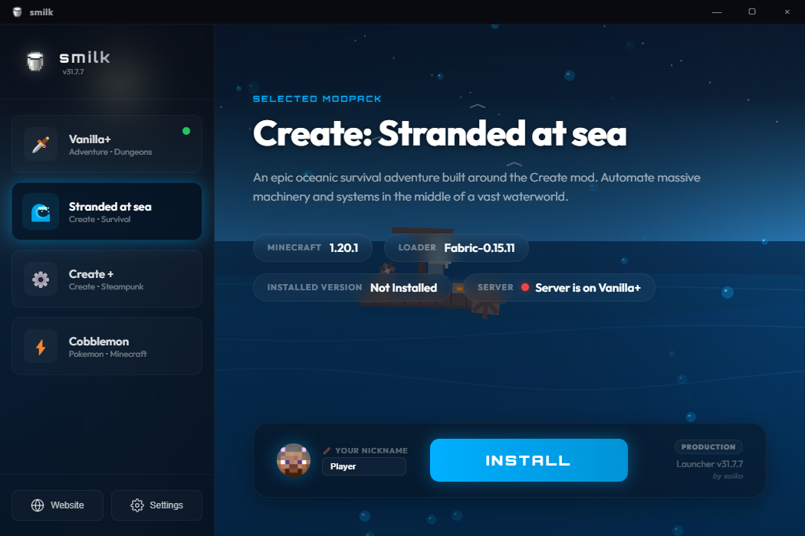
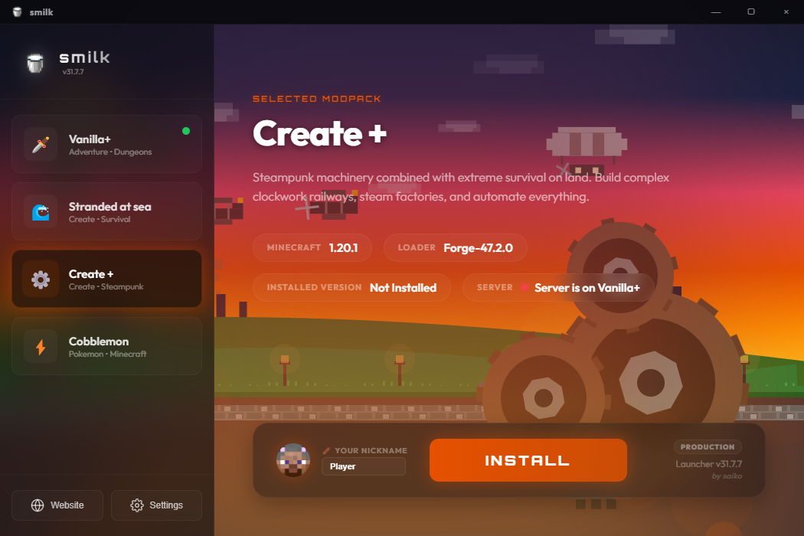
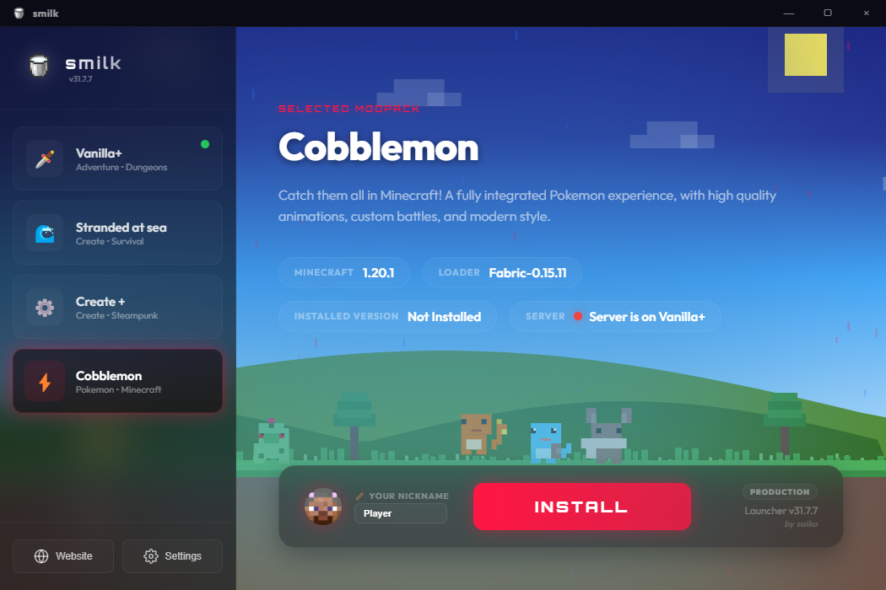
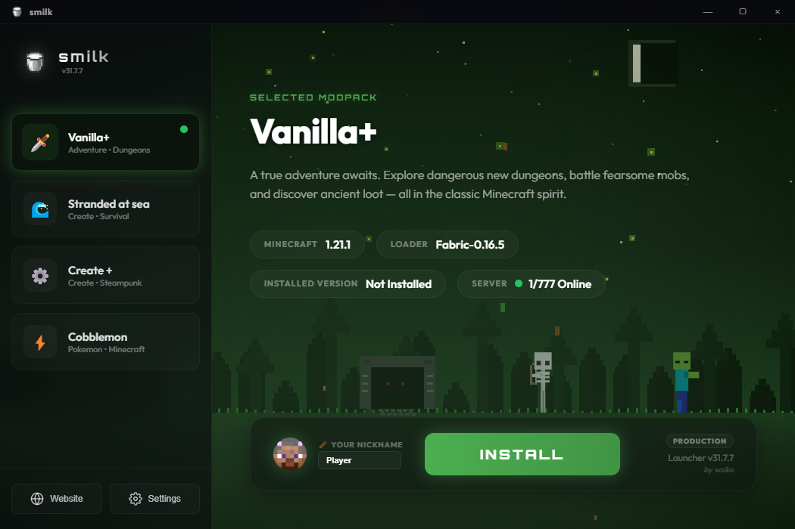
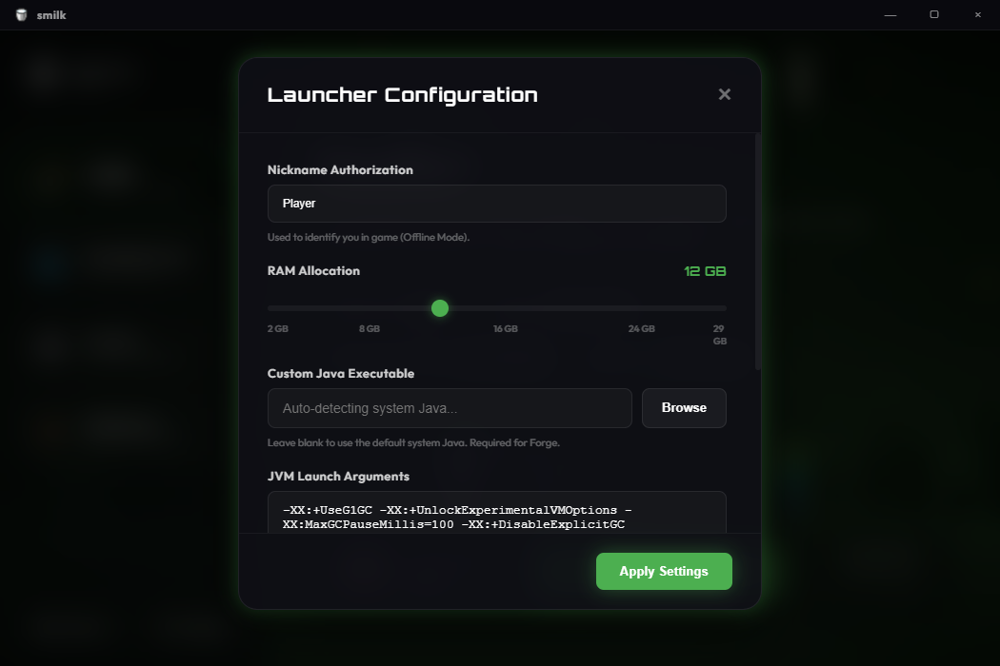

# smilk launcher 🥛🧊

[](https://electronjs.org/)
[](https://nodejs.org/)
[](https://minecraft.net/)
[](#)

A custom, premium Minecraft launcher built with **Electron**, **Node.js**, and **minecraft-launcher-core**. Designed with a sleek, modern UI, glassmorphic layout, dynamic pixel-art animations, and built-in support for downloading and installing `.mrpack` modpacks (Modrinth).

---

## 🎨 Themes & Visuals

The launcher features multiple custom pixel-art interactive themes that dynamically match the selected modpack. 

| 🌊 Create: Stranded at Sea | ⚙️ Create + |
| :---: | :---: |
|  |  |

| 🦁 Cobblemon | 🌲 Vanilla+ |
| :---: | :---: |
|  |  |

| 🔧 Settings Panel |
| :---: |
|  |

---

## ✨ Features

- **Premium UI/UX Design**: Sleek dark mode, glassmorphism (`backdrop-filter`), vibrant glow effects, and modern fonts (Orbitron, Outfit, Montserrat).
- **Dynamic Interactive Scenes**: 
  - **Stranded at Sea**: Floating raft with moving water wheel and bubbles.
  - **Create +**: Spinning gears, airships, rolling trains, and steam particles.
  - **Cobblemon**: Pixelated landscape with animated Pokémon (Pikachu, Squirtle, etc.), sparks, and rolling Pokeballs.
  - **Vanilla+**: Dark forest dungeon archway with fireflies, falling leaves, and animated Creeper, Zombie, and Skeleton mobs (with a bow aiming posture).
- **Automatic Minecraft Skin Avatars**: Fetches and renders the player's 2D Minecraft face skin in real-time from `mc-heads.net` API based on nickname (falls back to Steve/Alex for offline accounts).
- **Network & RAM Optimization**: 
  - Debounced nick input (500ms delay) to save API calls.
  - Automatic Chromium cache cleaning on startup to prevent RAM/Disk bloat.
  - Smart animation freezing (pauses rendering completely when the game starts to preserve 100% of your PC's power for Minecraft).
- **Full Modrinth Modpack Support**: Automatically downloads, extracts, and installs `.mrpack` modpacks from remote configurations.
- **Diagnostics**: Built-in debug console window showing real-time log streaming for game output, with Adoptium Java auto-installer fallback for missing dependencies.

---

## 🛠️ Tech Stack

- **Frontend**: HTML5, Vanilla CSS3 (custom variables, transitions), Javascript.
- **Backend**: Electron (Main process), Node.js.
- **Core Library**: `minecraft-launcher-core` (MCLC) for launching game processes.
- **Modpack Handling**: `adm-zip` for `.mrpack` parsing and extraction.

---

## 🚀 Running Locally

### Prerequisites
- [Node.js](https://nodejs.org/) (v18 or newer recommended)
- Java (Adoptium JDK 17/21 recommended for modern Minecraft versions)

### Setup
1. Clone the repository:
   ```bash
   git clone https://github.com/Saiko6540/smilk-launcher.git
   cd smilk-launcher
   ```

2. Install dependencies:
   ```bash
   npm install
   ```

3. Run the launcher in development mode:
   ```bash
   npm start
   ```

---

## 📦 Building for Production

To package the application and generate a standalone `.exe` installer for Windows:

```bash
npm run build
```

The compiled installer will be available inside the `dist/` directory.

---

*Created with ❤️ by [Saiko](https://github.com/Saiko6540)*
